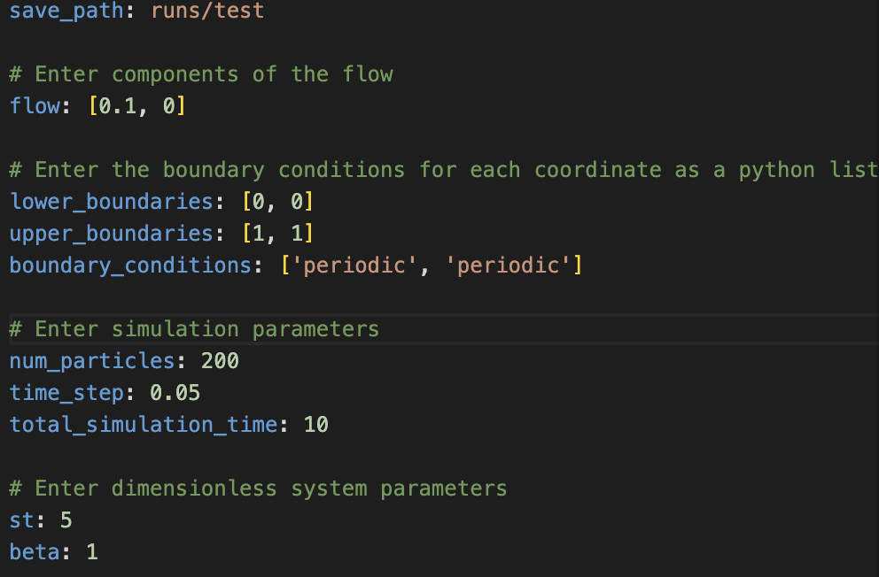

# PyPLF

Code base for simulating particle laden flows. Optimized for ease of use rather than depth of capability. 

## Setup

Clone the repository from the github

    git clone ...

Install and activate the conda environment in the environments.yml file

    conda env create -f environment.yml

    conda activate pyplf

## Setting Simulation Parameters

The input parameters for the code are controlled via the config.yml file. The current config file serves as a working example. The config file looks like this 

save_path: path to location you want to save output data and animation

flow: List of the components of the flow field. Enter 1-3 elements list to simulate in 1-3 dimensions. To enter variable dependent functions format them as you would a python function. i.e. [2*x, y**2]. Use variables (x, y, z, t)

lower_boundary: List of scalar lower boundary values. Enter the same number of components as the flow. 

upper_boundary: List of scalar upper boundary values. Enter the same number of components as the flow. 

boundary_conditions: List of each dimensions boundary conditions. Enter the same number of components as the flow. Options are 'open' and 'periodic'.

num_particles: Scalar number of particles in simulation

time_step: Scalar numerical interation time step for the simulation

total_simulation_time: Scalar total time that the simulation runs for

st: scalar stokes number controling particle inertia. Range [0.05, inf]

beta: Scalar dimensionless particle density. Range [0.1, 3]

## Executing Code

Execute code using the run_simulation.sh bash file with config.yml as the argument

    bash run_simulation.sh config.yml

This runs the simulation and generates the animation of particle trajectories. Saves data as .h5 file and animaiton as .mp4. By default saves in runs directory.

## Array Slicing Guide

We take full advantage of numpy's built in vectorization in this library. It leads to order of magntitude speed ups in the differential equation solving part of this code. It requires some complicated array slicing to implement this properly so we have provided an explanation of all the array slicing that we use.

We initalize 2 arrays for tracking particle statistics. Each array stores data for all particles for all time steps.

particle_pos_vel is a initalized with dimensions 
(particle number, simulation step number, number of dimensions * 2). This stores each particles postion coordiantes and velocity components. These are stored togeather for more efficent computations. 

particle_acc is initalized with dimensions (particle number, simulation step number, number of dimensions). This stores each particles acceleration components.

The array slicing is the same for both arrays. 

particle_acc[k] - Returns data for all time steps and components for the kth particle 

particle_acc[:, i] - Returns data for ith time step of all particles

particle_acc[:, :, j] - Returns data for jth component for all particles and time steps

particle_acc[:, :, j1:j2] - Returns data for j1th-j2th component sfor all particles and time steps

particle_acc[:, i][k] - Returns data for all components of the kth particle and the ith time step

### Particle Equation of Motion Details

Genral Particle Equation of Motion:

$\mathbf{\ddot{x}_p} = \beta \frac{D\mathbf{u}}{Dt} + \frac{1}{St}(\mathbf{u} - \mathbf{\dot{x}_p}) + \frac{1}{Fr}\mathbf{\hat{g}}$

$St$ - Stokes Number $(0,\infty)$. Large number is high inertia. How quickly particle responds to the flow. Formula depends on system 

$\beta$ - Dimensionless density ratio $\frac{3\rho_f}{\rho_f+2\rho_p}$. $0 < \beta < 1$, $ 1 < \beta < 3$ (Rising Particle). Same formula for all systems.

$Fr$ - Froude Number. Can be recast as $Fr = St/v_s$ where $v_s$ is the dimensionless settling speed.

Note if no gravity in simulation Fr is very large. It is best practice to remove the term from the equation.

### Flow Equation Parsing

Uses sympy to take input string and parse it into python executable functions. Currently only works for native python operations i.e not sin and cos. 

### Animation Details

Currently only works for 2D simualtions

